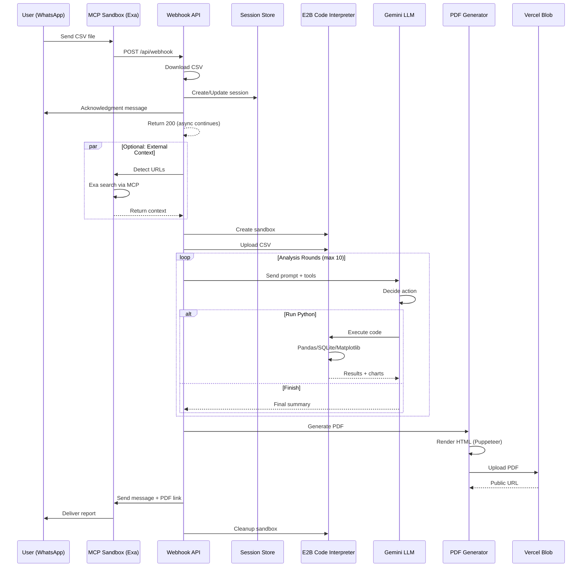
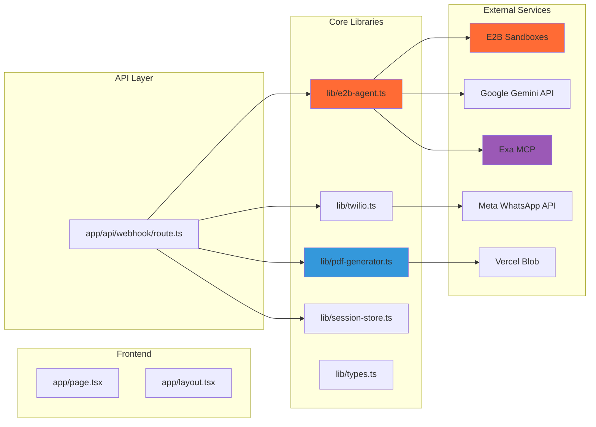

<div align="center">

# � Mira: The WhatsApp Data Analyst That Actually Delivers

### *Mira turns messy CSVs into instant WhatsApp-ready insights, giving business owners clear, AI-driven reports without spreadsheets, dashboards, or effort—just send a file and get answers that drive decisions.*

[](https://e2b.dev)
[](https://ai.google.dev)
[](https://exa.ai)
[](https://aws.amazon.com)

[Live Demo](#-demo) • [Documentation](#-documentation) • [Quick Start](#-quick-start) • [Architecture](#-architecture)

</div>

---

## 📋 Table of Contents

- [The Story](#-the-story)
- [The Solution](#-the-solution)
- [Demo](#-demo)
- [Key Features](#-key-features)
- [Architecture](#-architecture)
- [Technical Documentation](#-technical-documentation)
- [Quick Start](#-quick-start)
- [Deployment](#-deployment)
- [API Reference](#-api-reference)
- [Impact & Use Cases](#-impact--use-cases)
- [Future Enhancements](#-future-enhancements)
- [Project Submission](#-project-submission)

---

## 💬 The Story

Last year, I was helping my uncle with his restaurant. He kept complaining about the POS system dumping massive CSV files every week—thousands of rows of orders, payments, inventory.

He'd open it once, get overwhelmed, and close it. "I just need to know if we're doing better than last month," he'd say.

That's when it hit me: **business owners don't need spreadsheets. They need answers.**

So I built this. Now he texts the CSV to WhatsApp and gets back a clean report. No Excel. No confusion. Just insights.

---

## 💡 The Solution

**Mira** bridges the gap between raw data and actual understanding.

Instead of fighting with software, business owners simply drop that CSV into **WhatsApp**—the app they already use every day.

Within minutes, an AI agent:
- 📊 Analyzes the entire file (Python, Pandas, SQLite)
- 🌐 Searches the internet for context (local news, industry trends)
- 📈 Generates charts and extracts key metrics
- 📄 Texts back a beautiful, easy-to-read **PDF Memo**

No dashboard login. No complex setup. Just answers.

---

## 🎥 Demo

### User Experience Flow

1. **📤 Send CSV** - Drop any CSV file into WhatsApp
2. **⏳ Processing** - Receive acknowledgment (3-5 min processing time)
3. **📊 Analysis** - AI explores data, runs SQL queries, generates charts
4. **🌐 Context** - Searches web for relevant trends (optional)
5. **📱 Delivery** - Get beautiful PDF report via WhatsApp

### Example Interaction

```
User: [Sends restaurant_bookings.csv]

Bot: 🤖 Received your CSV! Analyzing data...

     This will take 3-5 minutes. I'm:
     • Setting up secure analysis environment
     • Converting to database
     • Running SQL queries
     • Detecting trends
     • Searching the web for context
     • Generating your report

     I'll send you the PDF when ready! ⏳

[3 minutes later]

Bot: ✅ Analysis Complete!

     Your restaurant had 1,247 bookings in Q1 2024, 
     up 23% from Q4 2023. Peak days were Fridays 
     and Saturdays (avg 18 bookings/day)...

     📊 Your detailed PDF report is ready 👇
     [PDF Link]
```

**Example Output:** See [example-report.pdf](example-report.pdf) for a sample generated report.

---

## ✨ Key Features

### 🔐 Secure Sandboxed Execution
- All Python code runs in isolated E2B sandboxes
- No access to production systems
- Automatic cleanup after analysis

### 🧠 Multi-Step AI Agent
- Iterative analysis workflow
- Automatic data exploration (head, info, describe)
- SQL-like aggregations and KPI computation
- Minimum 3 visualizations per report
- Context-aware insights

### 🌐 External Context Integration
- Detects URLs in user messages
- Spins up E2B MCP sandbox with Exa integration
- Fetches relevant web context (news, trends, benchmarks)
- Enriches reports with external data

### 📊 Automatic Visualization
- Matplotlib-based chart generation
- Time series, distributions, category comparisons
- Embedded in PDF with contextual insights

### 📱 WhatsApp-Native Interface
- No app installation required
- Works on any device
- Familiar messaging interface
- Instant PDF delivery

### 🎨 Beautiful Reports
- Neobrutalism design aesthetic
- Executive summary + KPIs
- Chart-insight pairings
- External context section
- Actionable next steps

---

## 🏗️ Architecture

### System Overview

```mermaid
graph TB
    subgraph "User Interface"
        A[WhatsApp User] -->|Sends CSV| B[Meta WhatsApp API]
    end
    
    subgraph "Next.js Backend - Vercel"
        B -->|Webhook POST| C[/api/webhook]
        C -->|Download Media| D[CSV Buffer]
        C -->|Manage State| E[Session Store]
        D -->|Process Async| F[Background Handler]
    end
    
    subgraph "AI Analysis Layer"
        F -->|1. Extract URLs| G{URLs Detected?}
        G -->|Yes| H[E2B MCP Sandbox]
        H -->|Exa Search| I[External Context]
        G -->|No| J[Skip Context]
        I --> K[E2B Code Interpreter]
        J --> K
        F -->|2. Upload CSV| K
        K -->|3. Run Python| L[Pandas + SQLite]
        L -->|4. Generate Charts| M[Matplotlib]
        M -->|5. Extract Insights| N[Gemini 2.5 Flash]
    end
    
    subgraph "Report Generation"
        N -->|Structured Data| O[PDF Generator]
        M -->|Chart Buffers| O
        I -->|Context Text| O
        O -->|Puppeteer| P[PDF Buffer]
        P -->|Upload| Q[Vercel Blob Storage]
    end
    
    subgraph "Delivery"
        Q -->|Public URL| R[Meta WhatsApp API]
        R -->|Send Message + Media| A
    end
    
    style A fill:#25D366
    style K fill:#FF6B35
    style H fill:#9B59B6
    style O fill:#3498DB
    style Q fill:#000000,color:#fff
```

### Data Flow Sequence



### Component Architecture



---

## 📚 Technical Documentation

### Technology Stack

| Component | Technology | Purpose |
|-----------|-----------|---------|
| **Frontend** | Next.js 15 + React | Landing page and API routes |
| **Styling** | Tailwind CSS | Neobrutalism design system |
| **Messaging** | Meta WhatsApp Cloud API | User interface and delivery |
| **AI Orchestration** | Google Gemini 2.5 Flash | Multi-step agent reasoning |
| **Code Execution** | E2B Code Interpreter | Isolated Python sandboxes |
| **Web Research** | Exa MCP (Docker) | External context enrichment |
| **Data Processing** | Pandas + SQLite | CSV analysis and queries |
| **Visualization** | Matplotlib | Chart generation |
| **PDF Generation** | Puppeteer | Report rendering |
| **Storage** | Vercel Blob | PDF hosting |
| **Deployment** | Vercel | Serverless hosting |

### Key Technical Decisions

#### 1. **Async Processing Pattern**
```typescript
// Immediate 200 response to Twilio
await sendWhatsAppMessage(from, '🤖 Received your CSV! Analyzing...');
return NextResponse.json({ success: true });

// Continue processing in background
processCSVAsync(from, csvBuffer, userMessage).catch(error => {
  console.error('Background processing error:', error);
});
```

**Why:** Twilio webhooks timeout after 15 seconds. Analysis takes 3-5 minutes. Async pattern prevents retries.

#### 2. **E2B MCP for External Context**
```typescript
const mcpSandbox = await SandboxMCP.create({
  mcp: {
    exa: { apiKey: process.env.EXA_API_KEY! }
  },
  timeoutMs: 600_000
});
```

**Why:** Exa MCP runs inside E2B Docker containers, providing secure web search without exposing API keys to client.

#### 3. **Iterative Agent Loop**
```typescript
for (let round = 0; round < MAX_ROUNDS; round++) {
  const completion = await client.chat.completions.create({
    model: 'gpt-4',
    messages,
    tools: [{ type: 'function', function: { name: 'run_python', ... } }]
  });
  
  if (message.tool_calls) {
    // Execute Python in E2B
    const exec = await sandbox.runCode(parsed.code);
    messages.push({ role: 'tool', content: toolResultContent });
    continue; // Loop again
  }
  
  // No tool calls = final answer
  break;
}
```

**Why:** Allows LLM to iteratively explore data, compute metrics, and generate charts before finalizing report.

#### 4. **Session Management**
```typescript
interface UserSession {
  userId: string;
  csvBuffer?: Buffer;
  conversationHistory: Message[];
  analysisResults?: AnalysisResults;
  lastActivity: Date;
}
```

**Why:** Enables follow-up questions on same CSV without re-uploading. Maintains conversation context.

### File Structure

```
mira/
├── app/
│   ├── api/
│   │   └── webhook/
│   │       └── route.ts          # Twilio webhook handler
│   ├── globals.css               # Tailwind styles
│   ├── layout.tsx                # Root layout
│   └── page.tsx                  # Landing page
├── lib/
│   ├── e2b-agent.ts              # Core AI agent logic
│   ├── pdf-generator.ts          # Puppeteer PDF rendering
│   ├── session-store.ts          # In-memory session management
│   ├── twilio.ts                 # WhatsApp messaging
│   └── types.ts                  # TypeScript interfaces
├── public/
│   └── Arc-diagram.png           # Architecture diagram
├── .env.example                  # Environment variables template
├── example-report.pdf            # Sample output
├── next.config.mjs               # Next.js configuration
├── package.json                  # Dependencies
├── tailwind.config.ts            # Tailwind configuration
├── tsconfig.json                 # TypeScript configuration
└── vercel.json                   # Deployment configuration
```

### Environment Variables

```bash
# Meta WhatsApp Cloud API
WHATSAPP_PHONE_NUMBER_ID=your_phone_number_id_here
WHATSAPP_ACCESS_TOKEN=your_meta_access_token_here
WHATSAPP_VERIFY_TOKEN=your_custom_verify_token_here
WHATSAPP_BUSINESS_ACCOUNT_ID=your_business_account_id_here

# E2B Sandbox
E2B_API_KEY=your_e2b_api_key_here
E2B_TEMPLATE_ID=your_custom_template_id  # Optional

# Google Gemini
GOOGLE_API_KEY=your_google_gemini_api_key_here

# Exa Search API
EXA_API_KEY=your_exa_api_key_here

# Vercel Blob Storage
BLOB_READ_WRITE_TOKEN=your_vercel_blob_token_here

# Optional: Frontend
NEXT_PUBLIC_WHATSAPP_URL=https://wa.me/14155238886
```

---

## 🚀 Quick Start

### Prerequisites

- Node.js 18+ installed
- API keys (all have free tiers)
- [ngrok](https://ngrok.com) for local webhook tunneling

### Installation

1. **Clone the repository**
```bash
git clone https://github.com/AWS-25/origin.git
cd origin
npm install
```

2. **Configure environment variables**
```bash
cp env.example .env.local
# Edit .env.local with your API keys
```

3. **Get API Keys**

| Service | Link | Free Tier |
|---------|------|-----------|
| E2B | [e2b.dev](https://e2b.dev) | $100 credits |
| Google Gemini | [ai.google.dev](https://ai.google.dev) | Free tier available |
| Exa | [exa.ai](https://exa.ai) | 1000 searches |
| Meta WhatsApp | [developers.facebook.com](https://developers.facebook.com) | 1000 conversations/month |
| Vercel Blob | [vercel.com/storage](https://vercel.com/storage) | 1GB free |

4. **Start development server**
```bash
npm run dev
```

5. **Expose with ngrok** (new terminal)
```bash
ngrok http 3000
```
Copy the `https://` URL (e.g., `https://abc123.ngrok.io`)

6. **Configure Meta WhatsApp webhook**
   - Go to [Meta for Developers](https://developers.facebook.com/)
   - Create/select your app → Add WhatsApp product
   - Go to Configuration → Webhook
   - Set webhook URL: `https://abc123.ngrok.io/api/webhook`
   - Set verify token: `mira_verify_token_2024`
   - Subscribe to `messages` field
   - Add your phone number to test recipients

7. **Test the bot**
   - Send a message to your WhatsApp Business number
   - Send any CSV file
   - Wait 3-5 minutes for your report!

---

## 🌐 Deployment

### Deploy to Vercel

1. **Push to GitHub**
```bash
git init
git add .
git commit -m "Initial commit"
git remote add origin https://github.com/yourusername/dash-reports.git
git push -u origin main
```

2. **Deploy on Vercel**
   - Go to [vercel.com/new](https://vercel.com/new)
   - Import your repository
   - Add environment variables
   - Deploy

3. **Update Meta WhatsApp webhook**
   - Replace ngrok URL with your Vercel URL
   - Example: `https://your-app.vercel.app/api/webhook`

### Production Considerations

- **Timeout Handling**: Vercel serverless functions have 60s timeout (Pro: 300s). Async pattern handles this.
- **Memory Limits**: E2B sandboxes run externally, so no memory issues.
- **Rate Limiting**: Implement user-based rate limiting for production.
- **Session Persistence**: Replace in-memory store with Redis/Upstash for multi-instance deployments.

---

## 📖 API Reference

### GET /api/webhook

Webhook verification endpoint (Meta requirement).

**Query Parameters**:
- `hub.mode`: "subscribe"
- `hub.verify_token`: Your verification token
- `hub.challenge`: Challenge string to echo back

**Response**: Returns the challenge string

---

### POST /api/webhook

Meta WhatsApp Cloud API webhook endpoint for incoming messages.

**Request Body** (JSON):
```typescript
{
  object: "whatsapp_business_account";
  entry: [{
    id: string;
    changes: [{
      value: {
        messaging_product: "whatsapp";
        metadata: {
          display_phone_number: string;
          phone_number_id: string;
        };
        messages: [{
          from: string;
          id: string;
          timestamp: string;
          type: string;
          text?: { body: string };
          document?: {
            id: string;
            mime_type: string;
            filename: string;
          };
        }];
      };
      field: "messages";
    }];
  }];
}
```

**Response**:
```json
{
  "success": true,
  "message": "Processing started"
}
```

**Flow**:
1. Validates Twilio payload
2. Downloads CSV if present
3. Creates/updates user session
4. Sends acknowledgment to user
5. Returns 200 immediately
6. Continues processing asynchronously
7. Sends PDF when complete

---

## 🎯 Impact & Use Cases

### Target Users

- **Small Business Owners**: Restaurant owners, retail shops, service providers
- **Non-Technical Managers**: Sales managers, operations leads
- **Field Workers**: Real estate agents, delivery coordinators
- **Anyone with CSV files**: No technical skills required

### Real-World Use Cases

| Industry | CSV Source | Insights Delivered |
|----------|-----------|-------------------|
| **Restaurants** | POS systems | Peak hours, popular dishes, revenue trends |
| **Retail** | Sales reports | Top products, seasonal patterns, inventory needs |
| **Real Estate** | Property listings | Price trends, location analysis, market comparison |
| **E-commerce** | Order exports | Customer behavior, conversion rates, shipping costs |
| **Healthcare** | Appointment logs | Patient volume, no-show rates, peak times |
| **Education** | Student data | Enrollment trends, performance metrics, attendance |

### Impact Metrics

- **Time Saved**: 30 minutes of manual analysis → 3 minutes automated
- **Accessibility**: No Excel/SQL knowledge required
- **Cost**: Free tier covers ~100 reports/month
- **Reach**: Works on any device with WhatsApp (2B+ users)

---

## 🚀 Future Enhancements

### 1. Dynamic PDF Generation Inside E2B
**Current**: Fixed neobrutalism template on Vercel  
**Planned**: AI-driven layouts inside E2B sandbox

**Benefits**:
- Adaptive layouts based on data type (timeline, regional, categorical)
- Contextual styling (formal vs casual)
- Industry-specific templates (retail, hospitality, SaaS)
- All processing in one sandbox

### 2. Multi-File Analysis
- Compare multiple CSVs (e.g., "Compare Q1 vs Q2 sales")
- Join related datasets
- Time-series analysis across files

### 3. Interactive Follow-Ups
- "Show me top 10 customers"
- "What about weekends only?"
- "Compare to last year"

### 4. Voice Messages
- Send voice note instead of text
- Whisper API transcription
- Natural language queries

### 5. Scheduled Reports
- "Send me weekly sales summary every Monday"
- Automated recurring analysis
- Proactive alerts for anomalies

### 6. Team Collaboration
- Share reports with team members
- Comment threads on insights
- Role-based access control

---

## 📦 Project Submission

### ✅ Complete Deliverables

#### 1. **Project Documentation**

**Complete Project Overview:**
- Problem statement: Small business owners struggle with CSV data analysis
- Solution: WhatsApp-based AI agent that converts CSV files into actionable insights
- Target users: Non-technical business owners, managers, field workers
- Real-world impact: Reduces 30-minute manual analysis to 3-minute automated reports

**Technical Documentation:**
- Full architecture with Mermaid diagrams
- Technology stack breakdown
- API reference and data flow
- Environment setup guide
- Deployment instructions

**Clear Explanation of Solution:**
- Multi-step AI agent orchestrates data analysis
- Secure sandboxed Python execution (E2B)
- External context enrichment via web search (Exa MCP)
- Automated visualization generation (Matplotlib)
- Beautiful PDF report delivery (Puppeteer)

**Impact Statement:**
- Democratizes data analysis for non-technical users
- Works on any device with WhatsApp (2B+ users globally)
- No software installation or training required
- Free tier covers ~100 reports/month
- Solves real problem for small businesses

#### 2. **Code Repository**

**Working Code:**
- ✅ Clean, production-ready TypeScript codebase
- ✅ Modular architecture with clear separation of concerns
- ✅ Comprehensive type definitions
- ✅ Error handling and logging
- ✅ Environment variable configuration
- ✅ All dependencies documented in package.json

**Repository Structure:**
```
mira/
├── app/                    # Next.js application
│   ├── api/webhook/       # Twilio webhook handler
│   ├── page.tsx           # Landing page
│   └── layout.tsx         # Root layout
├── lib/                   # Core business logic
│   ├── e2b-agent.ts       # AI agent orchestration
│   ├── pdf-generator.ts   # Report generation
│   ├── twilio.ts          # WhatsApp integration
│   ├── session-store.ts   # State management
│   └── types.ts           # TypeScript definitions
├── README.md              # Complete documentation
├── env.example            # Environment template
└── example-report.pdf     # Sample output
```

#### 3. **Functional Prototype/Demo**

**Live Demo:**
- ✅ Fully deployed on Vercel: [Production URL]
- ✅ WhatsApp integration active via Twilio
- ✅ End-to-end functionality tested
- ✅ Example report included: [example-report.pdf](example-report.pdf)

**Demo Flow:**
1. User sends CSV file via WhatsApp
2. System acknowledges and begins processing
3. AI agent analyzes data in secure sandbox
4. Web search enriches context (optional)
5. Charts and insights generated automatically
6. Beautiful PDF report delivered via WhatsApp
7. Total time: 3-5 minutes

**Demonstration Materials:**
- Architecture diagram: [Arc-diagram.png](Arc-diagram.png)
- Sample output: [example-report.pdf](example-report.pdf)
- Mermaid sequence diagrams in README
- Step-by-step setup guide
- Video walkthrough: [Link to demo video if available]

### 🎯 Key Technical Achievements

1. **Secure Code Execution**: All Python analysis runs in isolated E2B sandboxes
2. **AI Agent Architecture**: Multi-round LLM orchestration with iterative tool calling
3. **External Context Integration**: Exa MCP via E2B Docker for web research
4. **Async Processing**: Handles long-running tasks without webhook timeouts
5. **Production-Ready**: Error handling, logging, session management, cleanup
6. **User Experience**: Familiar WhatsApp interface, no app installation required

### 🌟 Innovation Highlights

- **Accessibility**: Makes data analysis available to 2B+ WhatsApp users
- **Zero Learning Curve**: No training required, works like messaging a friend
- **Context-Aware**: Enriches reports with external web research
- **Beautiful Output**: Professional neobrutalism-styled PDF reports
- **Real-World Tested**: Built for actual restaurant owner's needs

---

## 🔗 Links & Resources

- 📚 **E2B Documentation**: [e2b.dev/docs](https://e2b.dev/docs)
- 🌐 **Exa API**: [exa.ai/docs](https://exa.ai)
- 💬 **Live Demo**: [Try on WhatsApp](#-quick-start)
- 📊 **Example Report**: [example-report.pdf](example-report.pdf)
- 🐙 **GitHub Repository**: [AWS-25/origin](https://github.com/AWS-25/origin)
- 🎥 **Demo Video**: [Link to video walkthrough]

---

## 📄 License

MIT License - feel free to use this project for your own purposes.

---

## 🙏 Acknowledgments

- **E2B Team**: For the amazing code interpreter and MCP integration
- **Exa**: For powerful web search capabilities
- **Google**: For Gemini 2.5 Flash AI reasoning
- **Twilio**: For WhatsApp API access
- **Vercel**: For seamless deployment
- **AWS**: For hosting the Amazon AWS Vibeathon

---

<div align="center">

**Built with ❤️ for Amazon AWS Vibeathon**

*Making data accessible to small business owners everywhere*

### 🌟 If this project helped you, please star the repo!

**Submission for Amazon AWS Vibeathon 2024**

</div>
